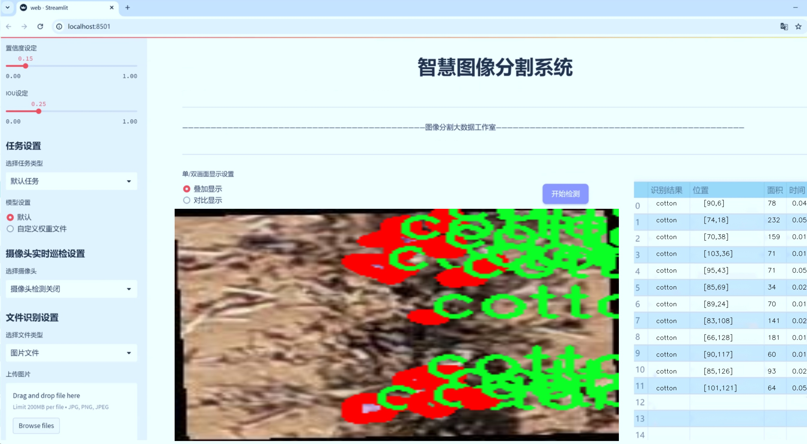
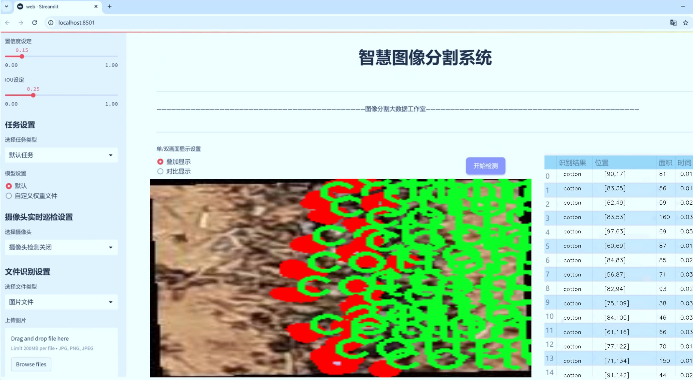
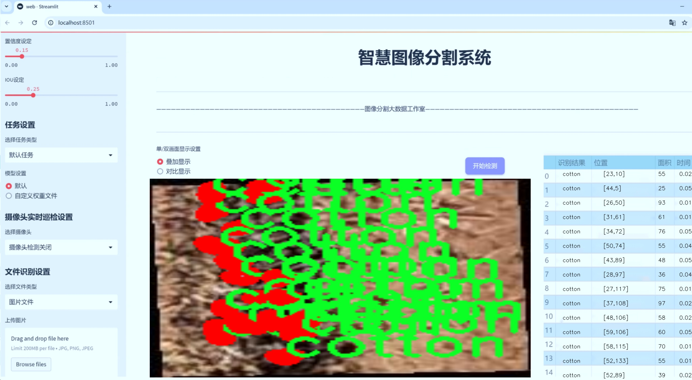
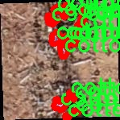
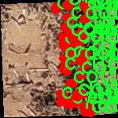
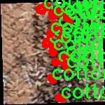
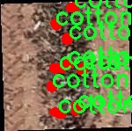

# 棉花产量预测分割系统： yolov8-seg-bifpn

### 1.研究背景与意义

[参考博客](https://gitee.com/YOLOv8_YOLOv11_Segmentation_Studio/projects)

[博客来源](https://kdocs.cn/l/cszuIiCKVNis)

研究背景与意义

随着全球人口的不断增长，粮食安全问题日益突出，农业生产的效率和可持续性成为各国政府和科研机构关注的重点。在众多农作物中，棉花作为重要的经济作物，不仅是纺织工业的基础原料，也是农民收入的重要来源。因此，提升棉花的产量和质量，优化种植管理策略，对于促进农业可持续发展、保障农民生计、推动地方经济发展具有重要意义。然而，传统的棉花产量预测方法往往依赖于经验和历史数据，难以适应快速变化的气候条件和市场需求。因此，基于先进的计算机视觉技术，尤其是深度学习方法的棉花产量预测分割系统的研究显得尤为重要。

近年来，YOLO（You Only Look Once）系列模型因其高效的实时目标检测能力而受到广泛关注。YOLOv8作为该系列的最新版本，进一步提升了检测精度和速度，具有较强的应用潜力。通过对YOLOv8进行改进，结合实例分割技术，可以实现对棉花生长状态的精准识别与分析，从而为棉花产量的预测提供更为可靠的数据支持。该研究旨在构建一个基于改进YOLOv8的棉花产量预测分割系统，利用1500张图像的数据集，涵盖了棉花的不同生长阶段和环境条件，进行深入的模型训练与验证。

本研究的意义在于，首先，通过引入深度学习技术，能够实现对棉花生长状态的自动化监测与分析，减少人工干预，提高工作效率。其次，改进YOLOv8模型的应用，不仅能够提升棉花目标检测的精度，还能通过实例分割技术，实现对棉花与其他植物或杂草的有效区分，为精准农业提供数据支持。此外，研究中所使用的1500张图像数据集，涵盖了三类主要类别（棉花、杂草和土壤），为模型的训练提供了丰富的样本，有助于提高模型的泛化能力和适应性。

通过建立这一系统，研究将为棉花种植者提供科学的决策依据，帮助他们更好地把握棉花的生长周期，优化施肥、灌溉和病虫害防治等管理措施，从而提高棉花的产量和质量。同时，该系统的成功应用也将为其他农作物的产量预测提供借鉴，推动农业智能化的发展。

综上所述，基于改进YOLOv8的棉花产量预测分割系统的研究，不仅具有重要的理论价值，还有着广泛的实际应用前景。通过深度学习技术的引入，能够为棉花种植提供更加科学、精准的管理方案，助力农业的可持续发展。

### 2.图片演示







注意：本项目提供完整的训练源码数据集和训练教程,由于此博客编辑较早,暂不提供权重文件（best.pt）,需要按照6.训练教程进行训练后实现上图效果。

### 3.视频演示

[3.1 视频演示](https://www.bilibili.com/video/BV12sBsY7EMZ/)

### 4.数据集信息

##### 4.1 数据集类别数＆类别名

nc: 3
names: ['cotton', 'f', 's']


##### 4.2 数据集信息简介

数据集信息展示

在现代农业生产中，棉花作为一种重要的经济作物，其产量的准确预测对于农民的决策和农业管理具有重要意义。为了实现这一目标，我们构建了一个名为“cotton_yield_prediction”的数据集，旨在为改进YOLOv8-seg的棉花产量预测分割系统提供高质量的训练数据。该数据集包含了丰富的图像数据和标注信息，能够有效支持深度学习模型在棉花产量预测中的应用。

“cotton_yield_prediction”数据集的类别数量为3，具体类别包括“cotton”（棉花）、“f”（病害）和“s”（土壤）。这些类别的选择不仅反映了棉花生长过程中可能影响产量的关键因素，也为模型的训练提供了多样化的样本。棉花（cotton）作为主要类别，涵盖了不同生长阶段的棉花植株图像，能够帮助模型学习到棉花的生长特征和形态变化。病害（f）类别则专注于棉花植株上常见的病虫害图像，这些病害对棉花的生长和最终产量有着直接的影响。通过对病害的识别，模型能够更好地评估其对棉花产量的潜在威胁。土壤（s）类别则包含了不同土壤条件下的图像，土壤的质量和类型是影响棉花生长的重要环境因素，能够为模型提供更全面的背景信息。

该数据集的构建过程注重数据的多样性和代表性，确保所收集的图像涵盖了不同的生长环境、气候条件和管理实践。我们从多个棉花种植区域收集了大量的图像数据，确保数据集的广泛性和适用性。此外，为了提高数据集的质量，我们对图像进行了严格的标注，确保每一张图像都能准确反映其对应的类别。这种高质量的标注不仅提高了模型的训练效果，也为后续的模型评估提供了可靠的基准。

在数据集的使用过程中，研究人员可以通过对“cotton_yield_prediction”数据集的分析，深入了解棉花生长的动态变化及其与环境因素之间的关系。通过将该数据集与YOLOv8-seg模型相结合，研究人员能够实现对棉花产量的精准预测，并通过分割技术识别出不同类别的区域，从而为农民提供科学的种植建议和管理策略。

总之，“cotton_yield_prediction”数据集不仅为棉花产量预测提供了重要的基础数据支持，也为农业智能化发展奠定了坚实的基础。随着深度学习技术的不断进步，该数据集的应用前景广阔，未来将为棉花种植的精准管理和可持续发展提供更多的可能性。通过对数据集的深入研究，我们期待能够推动棉花生产的智能化进程，提高农业生产效率，最终实现更高的经济效益和环境效益。










### 5.项目依赖环境部署教程（零基础手把手教学）

[5.1 环境部署教程链接（零基础手把手教学）](https://www.bilibili.com/video/BV1jG4Ve4E9t/?vd_source=bc9aec86d164b67a7004b996143742dc)


[5.2 安装Python虚拟环境创建和依赖库安装视频教程链接（零基础手把手教学）](https://www.bilibili.com/video/BV1nA4VeYEze/?vd_source=bc9aec86d164b67a7004b996143742dc)

### 6.手把手YOLOV8-seg训练视频教程（零基础手把手教学）

[6.1 手把手YOLOV8-seg训练视频教程（零基础小白有手就能学会）](https://www.bilibili.com/video/BV1cA4VeYETe/?vd_source=bc9aec86d164b67a7004b996143742dc)


按照上面的训练视频教程链接加载项目提供的数据集，运行train.py即可开始训练



     Epoch   gpu_mem       box       obj       cls    labels  img_size
     1/200     0G   0.01576   0.01955  0.007536        22      1280: 100%|██████████| 849/849 [14:42<00:00,  1.04s/it]
               Class     Images     Labels          P          R     mAP@.5 mAP@.5:.95: 100%|██████████| 213/213 [01:14<00:00,  2.87it/s]
                 all       3395      17314      0.994      0.957      0.0957      0.0843

     Epoch   gpu_mem       box       obj       cls    labels  img_size
     2/200     0G   0.01578   0.01923  0.007006        22      1280: 100%|██████████| 849/849 [14:44<00:00,  1.04s/it]
               Class     Images     Labels          P          R     mAP@.5 mAP@.5:.95: 100%|██████████| 213/213 [01:12<00:00,  2.95it/s]
                 all       3395      17314      0.996      0.956      0.0957      0.0845

     Epoch   gpu_mem       box       obj       cls    labels  img_size
     3/200     0G   0.01561    0.0191  0.006895        27      1280: 100%|██████████| 849/849 [10:56<00:00,  1.29it/s]
               Class     Images     Labels          P          R     mAP@.5 mAP@.5:.95: 100%|███████   | 187/213 [00:52<00:00,  4.04it/s]
                 all       3395      17314      0.996      0.957      0.0957      0.0845


### 7.50+种全套YOLOV8-seg创新点加载调参实验视频教程（一键加载写好的改进模型的配置文件）

[7.1 50+种全套YOLOV8-seg创新点加载调参实验视频教程（一键加载写好的改进模型的配置文件）](https://www.bilibili.com/video/BV1Hw4VePEXv/?vd_source=bc9aec86d164b67a7004b996143742dc)

### YOLOV8-seg算法简介

原始YOLOv8-seg算法原理

YOLOv8-seg算法是YOLO系列中的最新版本，继承并扩展了YOLOv8的基本架构，专注于目标检测与分割任务的结合。作为一种先进的单阶段目标检测算法，YOLOv8-seg不仅提高了检测精度和速度，还通过引入语义分割功能，增强了对复杂场景的理解能力。该算法的设计理念是将目标检测与图像分割任务有效结合，使得模型能够在同一框架下同时完成目标的定位与精确的像素级分割。

YOLOv8-seg的网络结构依然由输入端、主干网络、特征增强网络和检测头四个主要部分组成。在输入端，YOLOv8-seg采用了马赛克数据增强技术，这种方法通过将多张图像拼接在一起，增加了训练数据的多样性，从而提高了模型的泛化能力。此外，输入端还进行了自适应锚框计算和自适应灰度填充，以确保模型能够处理不同类型和尺寸的输入图像。

主干网络部分，YOLOv8-seg延续了YOLOv8的CSPNet（Cross Stage Partial Network）思想，采用了C2f模块替代了之前的C3模块。C2f模块通过引入更多的分支和跨层连接，增强了网络的梯度流动，使得特征提取更加高效。与此同时，YOLOv8-seg在特征提取过程中结合了空间金字塔池化（SPPF）结构，这一结构通过多尺度池化操作，能够有效地融合不同尺度的特征信息，从而提升模型对各种目标的检测能力。

特征增强网络部分，YOLOv8-seg采用了路径聚合网络（PAN）结构，这一结构的设计旨在加强不同尺度特征的融合能力。通过将特征金字塔与路径聚合网络相结合，YOLOv8-seg能够更好地捕捉到目标的语义信息和定位信息，从而在复杂场景中实现更为精准的目标检测与分割。特征增强网络的设计使得模型能够有效地处理不同尺度和形状的目标，尤其是在多目标场景下，能够保持较高的检测精度。

在检测头部分，YOLOv8-seg引入了解耦头结构，将目标分类与回归任务分离。这一设计使得模型在处理分类和定位任务时能够更加专注，避免了传统耦合头结构中任务间的干扰，从而提高了模型在复杂场景下的表现。YOLOv8-seg的检测头采用了Anchor-free的目标检测方法，摒弃了传统的锚框设计，直接通过回归方式预测目标的位置和大小。这种方法的优势在于简化了模型的设计，减少了锚框的选择和调整带来的复杂性，使得模型在训练和推理过程中更加高效。

在损失计算方面，YOLOv8-seg结合了多种损失函数，包括二元交叉熵损失（BCELoss）和分布焦点损失（DFLoss），以提升模型对边界框和分割区域的预测精度。特别是在分割任务中，YOLOv8-seg通过引入完全交并比损失函数（CIOULoss），有效地解决了目标边界模糊的问题，使得分割结果更加精确。

YOLOv8-seg的优势不仅体现在其高效的检测与分割能力上，还在于其轻量化的设计，使得该模型能够在各种嵌入式设备上进行实时部署。通过优化模型结构和减少参数量，YOLOv8-seg在保证检测精度的同时，显著提升了计算效率。这一特性使得YOLOv8-seg在实际应用中具有广泛的适用性，能够满足实时检测与分割的需求。

总的来说，YOLOv8-seg算法通过对YOLOv8的架构进行优化与扩展，成功地将目标检测与语义分割任务结合在一起，形成了一种高效、精准的解决方案。其在特征提取、特征融合、任务解耦和损失计算等多个方面的创新，使得YOLOv8-seg在处理复杂场景时表现出色，成为目标检测与分割领域的重要工具。随着计算机视觉技术的不断发展，YOLOv8-seg无疑将在更多实际应用中发挥重要作用，推动智能视觉系统的进步与普及。


### 9.系统功能展示（检测对象为举例，实际内容以本项目数据集为准）

图9.1.系统支持检测结果表格显示

  图9.2.系统支持置信度和IOU阈值手动调节

  图9.3.系统支持自定义加载权重文件best.pt(需要你通过步骤5中训练获得)

  图9.4.系统支持摄像头实时识别

  图9.5.系统支持图片识别

  图9.6.系统支持视频识别

  图9.7.系统支持识别结果文件自动保存

  图9.8.系统支持Excel导出检测结果数据


### 10.50+种全套YOLOV8-seg创新点原理讲解（非科班也可以轻松写刊发刊，V11版本正在科研待更新）

#### 10.1 由于篇幅限制，每个创新点的具体原理讲解就不一一展开，具体见下列网址中的创新点对应子项目的技术原理博客网址【Blog】：


[10.1 50+种全套YOLOV8-seg创新点原理讲解链接](https://gitee.com/qunmasj/good)

#### 10.2 部分改进模块原理讲解(完整的改进原理见上图和技术博客链接)【如果此小节的图加载失败可以通过CSDN或者Github搜索该博客的标题访问原始博客，原始博客图片显示正常】
### YOLOv8简介

YOLOv8是一种最新的SOTA算法，提供了N/S/M/L/X尺度的不同大小模型，以满足不同场景的需求。本章对算法网络的新特性进行简要介绍。


1）骨干网络和Neck
开发者设计了C2f模块对CSPDarkNet 53和PAFPN进行改造。相比C3模块，C2f模块拥有更多的分支跨层链接，使模型的梯度流更加丰富，显著增强了模型的特征提取能力。
2)Head部分
Head部分采用无锚框设计，将分类任务和回归任务进行了解耦，独立的分支将更加专注于其所负责的特征信息。
3）损失计算
模型使用CIOU Loss作为误差损失函数，并通过最小化DFL进一步提升边界框的回归精度。同时模型采用了TaskAlignedAssigner样本分配策略，以分类得分和IOU的高阶组合作为指标指导正负样本选择，实现了高分类得分和高IOU的对齐，有效地提升了模型的检测精度。


### D-LKA Attention简介
自2010年代中期以来，卷积神经网络（CNNs）已成为许多计算机视觉应用的首选技术。它们能够从原始数据中自动提取复杂的特征表示，无需手动进行特征工程，这引起了医学图像分析社区的极大兴趣。许多成功的CNN架构，如U-Net、全卷积网络、DeepLab或SegCaps（分割胶囊），已经被开发出来。这些架构在语义分割任务中取得了巨大成功，先前的最新方法已经被超越。

在计算机视觉研究中，不同尺度下的目标识别是一个关键问题。在CNN中，可检测目标的大小与相应网络层的感受野尺寸密切相关。如果一个目标扩展到超出这个感受野的边界，这可能会导致欠分割结果。相反，与目标实际大小相比使用过大的感受野可能会限制识别，因为背景信息可能会对预测产生不必要的影响。

解决这个问题的一个有希望的方法涉及在并行使用具有不同尺寸的多个Kernel，类似于Inception块的机制。然而，由于参数和计算要求的指数增长，将Kernel大小增加以容纳更大的目标在实践中受到限制。因此，出现了各种策略，包括金字塔池化技术和不同尺度的扩张卷积，以捕获多尺度的上下文信息。

另一个直观的概念涉及将多尺度图像金字塔或它们的相关特征表示直接纳入网络架构。然而，这种方法存在挑战，特别是在管理训练和推理时间方面的可行性方面存在挑战。在这个背景下，使用编码器-解码器网络，如U-Net，已被证明是有利的。这样的网络在较浅的层中编码外观和位置，而在更深的层中，通过神经元的更广泛的感受野捕获更高的语义信息和上下文信息。

一些方法将来自不同层的特征组合在一起，或者预测来自不同尺寸的层的特征以使用多尺度的信息。此外，出现了从不同尺度的层中预测特征的方法，有效地实现了跨多个尺度的见解整合。然而，大多数编码器-解码器结构面临一个挑战：它们经常无法在不同尺度之间保持一致的特征，并主要使用最后一个解码器层生成分割结果。

语义分割是一项任务，涉及根据预定义的标签集为图像中的每个像素预测语义类别。这项任务要求提取高级特征同时保留初始的空间分辨率。CNNs非常适合捕获局部细节和低级信息，尽管以忽略全局上下文为代价。视觉Transformer（ViT）架构已经成为解决处理全局信息的视觉任务的关键，包括语义分割，取得了显著的成功。

ViT的基础是注意力机制，它有助于在整个输入序列上聚合信息。这种能力使网络能够合并远程的上下文提示，超越了CNN的有限感受野尺寸。然而，这种策略通常会限制ViT有效建模局部信息的能力。这种局限可能会妨碍它们检测局部纹理的能力，这对于各种诊断和预测任务至关重要。这种缺乏局部表示可以归因于ViT模型处理图像的特定方式。

ViT模型将图像分成一系列Patch，并使用自注意力机制来模拟它们之间的依赖关系。这种方法可能不如CNN模型中的卷积操作对感受野内提取局部特征有效。ViT和CNN模型之间的这种图像处理方法的差异可能解释了CNN模型在局部特征提取方面表现出色的原因。

近年来，已经开发出创新性方法来解决Transformer模型内部局部纹理不足的问题。其中一种方法是通过互补方法将CNN和ViT特征结合起来，以结合它们的优势并减轻局部表示的不足。TransUNet是这种方法的早期示例，它在CNN的瓶颈中集成了Transformer层，以模拟局部和全局依赖关系。HiFormer提出了一种解决方案，将Swin Transformer模块和基于CNN的编码器结合起来，生成两个多尺度特征表示，通过Double-Level Fusion模块集成。UNETR使用基于Transformer的编码器和CNN解码器进行3D医学图像分割。CoTr和TransBTS通过Transformer在低分辨率阶段增强分割性能，将CNN编码器和解码器连接在一起。

增强局部特征表示的另一种策略是重新设计纯Transformer模型内部的自注意力机制。在这方面，Swin-Unet在U形结构中集成了一个具有线性计算复杂性的Swin Transformer块作为多尺度 Backbone 。MISSFormer采用高效Transformer来解决视觉Transformer中的参数问题，通过在输入块上进行不可逆的降采样操作。D-Former引入了一个纯Transformer的管道，具有双重注意模块，以分段的方式捕获细粒度的局部注意和与多元单元的交互。然而，仍然存在一些特定的限制，包括计算效率低下，如TransUNet模型所示，对CNN Backbone 的严重依赖，如HiFormer所观察到的，以及对多尺度信息的忽略。

此外，目前的分割架构通常采用逐层处理3D输入 volumetric 的方法，无意中忽视了相邻切片之间的潜在相关性。这一疏忽限制了对 volumetric 信息的全面利用，因此损害了定位精度和上下文集成。此外，必须认识到，医学领域的病变通常在形状上发生变形。因此，用于医学图像分析的任何学习算法都必须具备捕捉和理解这些变形的能力。与此同时，该算法应保持计算效率，以便处理3D volumetric数据。

为了解决上述提到的挑战，作者提出了一个解决方案，即可变形大卷积核注意力模块（Deformable LKA module），它是作者网络设计的基本构建模块。这个模块明确设计成在有效处理上下文信息的同时保留局部描述符。作者的架构在这两个方面的平衡增强了实现精确语义分割的能力。

值得注意的是，参考该博客引入了一种基于数据的感受野的动态适应，不同于传统卷积操作中的固定滤波器Mask。这种自适应方法使作者能够克服与静态方法相关的固有限制。这种创新方法还扩展到了D-LKA Net架构的2D和3D版本的开发。

在3D模型的情况下，D-LKA机制被量身定制以适应3D环境，从而实现在不同 volumetric 切片之间无缝信息交互。最后，作者的贡献通过其计算效率得到进一步强调。作者通过仅依靠D-LKA概念的设计来实现这一点，在各种分割基准上取得了显著的性能，确立了作者的方法作为一种新的SOTA方法。

在本节中，作者首先概述方法论。首先，作者回顾了由Guo等人引入的大卷积核注意力（Large Kernel Attention，LKA）的概念。然后，作者介绍了作者对可变形LKA模块的创新探索。在此基础上，作者介绍了用于分割任务的2D和3D网络架构。

大卷积核提供了与自注意力机制类似的感受野。可以通过使用深度卷积、深度可扩展卷积和卷积来构建大卷积核，从而减少了参数和计算量。构建输入维度为和通道数的卷积核的深度卷积和深度可扩展卷积的卷积核大小的方程如下：


具有卷积核大小和膨胀率。参数数量和浮点运算（FLOPs）的计算如下：


FLOPs的数量与输入图像的大小成线性增长。参数的数量随通道数和卷积核大小的增加而呈二次增长。然而，由于它们通常都很小，因此它们不是限制因素。

为了最小化对于固定卷积核大小K的参数数量，可以将方程3对于膨胀率的导数设定为零：


例如，当卷积核大小为时，结果是。将这些公式扩展到3D情况是直接的。对于大小为和通道数C的输入，3D情况下参数数量和FLOPs 的方程如下：


具有卷积核大小和膨胀。


利用大卷积核进行医学图像分割的概念通过引入可变形卷积得以扩展。可变形卷积可以通过整数偏移自由调整采样网格以进行自由变形。额外的卷积层从特征图中学习出变形，从而创建一个偏移场。基于特征本身学习变形会导致自适应卷积核。这种灵活的卷积核形状可以提高病变或器官变形的表示，从而增强了目标边界的定义。

负责计算偏移的卷积层遵循其相应卷积层的卷积核大小和膨胀。双线性插值用于计算不在图像网格上的偏移的像素值。如图2所示，D-LKA模块可以表示为：


其中输入特征由表示，。表示为注意力图，其中每个值表示相应特征的相对重要性。运算符  表示逐元素乘法运算。值得注意的是，LKA不同于传统的注意力方法，它不需要额外的规范化函数，如或。这些规范化函数往往忽视高频信息，从而降低了基于自注意力的方法的性能。

在该方法的2D版本中，卷积层被可变形卷积所替代，因为可变形卷积能够改善对具有不规则形状和大小的目标的捕捉能力。这些目标在医学图像数据中常常出现，因此这种增强尤为重要。

然而，将可变形LKA的概念扩展到3D领域会带来一定的挑战。主要的约束来自于需要用于生成偏移的额外卷积层。与2D情况不同，由于输入和输出通道的性质，这一层无法以深度可分的方式执行。在3D环境中，输入通道对应于特征，而输出通道扩展到，其中是卷积核的大小。大卷积核的复杂性导致沿第3D的通道数扩展，导致参数和FLOPs大幅增加。因此，针对3D情况采用了另一种替代方法。在现有的LKA框架中，深度卷积之后引入了一个单独的可变形卷积层。这种战略性的设计调整旨在减轻扩展到3D领域所带来的挑战。


2D网络的架构如图1所示。第一变种使用MaxViT作为编码器组件，用于高效特征提取，而第二变种则结合可变形LKA层进行更精细、卓越的分割。

在更正式的描述中，编码器生成4个分层输出表示。首先，卷积干扰将输入图像的维度减小到。随后，通过4个MaxViT块的4个阶段进行特征提取，每个阶段后跟随降采样层。随着过程进展到解码器，实施了4个阶段的D-LKA层，每个阶段包含2个D-LKA块。然后，应用Patch扩展层以实现分辨率上采样，同时减小通道维度。最后，线性层负责生成最终的输出。

2D D-LKA块的结构包括LayerNorm、可变形LKA和多层感知器（MLP）。积分残差连接确保了有效的特征传播，即使在更深层也是如此。这个安排可以用数学方式表示为：


其中输入特征，层归一化LN，可变形LKA注意力，深度卷积，线性层和GeLU激活函数。

3D网络架构如图1所示，采用编码器-解码器设计进行分层结构化。首先，一个Patch嵌入层将输入图像的维度从（）减小到（）。在编码器中，采用了3个D-LKA阶段的序列，每个阶段包含3个D-LKA块。在每个阶段之后，通过降采样步骤将空间分辨率减半，同时将通道维度加倍。中央瓶颈包括另一组2个D-LKA块。解码器结构与编码器相对称。

为了将特征分辨率加倍，同时减少通道数，使用转置卷积。每个解码器阶段都使用3个D-LKA块来促进远距离特征依赖性。最终的分割输出由一个卷积层产生，后面跟随一个卷积层以匹配特定类别的通道要求。

为了建立输入图像和分割输出之间的直接连接，使用卷积形成了一个跳跃连接。额外的跳跃连接根据简单的加法对来自其他阶段的特征进行融合。最终的分割图是通过和卷积层的组合产生的。

3D D-LKA块包括层归一化，后跟D-LKA注意力，应用了残差连接的部分。随后的部分采用了一个卷积层，后面跟随一个卷积层，两者都伴随着残差连接。这个整个过程可以总结如下：


带有输入特征 、层归一化 、可变形 LKA 、卷积层 和输出特征 的公式。是指一个前馈网络，包括2个卷积层和激活函数。

表7显示了普通卷积和构建卷积的参数数量比较。尽管标准卷积的参数数量在通道数较多时急剧增加，但分解卷积的参数总体较低，并且增长速度不那么快。

与分解卷积相比，可变形分解卷积增加了大量参数，但仍然明显小于标准卷积。可变形卷积的主要参数是由偏移网络创建的。在这里，作者假设可变形深度卷积的Kernel大小为（5,5），可变形深度空洞卷积的Kernel大小为（7,7）。这导致了21×21大小的大Kernel的最佳参数数量。更高效地生成偏移量的方法将大大减少参数数量。


值得注意的是，引入可变形LKA确实会增加模型的参数数量和每秒的浮点运算次数（FLOPS）。然而，重要的是强调，这增加的计算负载不会影响作者模型的整体推理速度。

相反，对于Batch-size > 1，作者甚至观察到推理时间的减少，如图7所示。例如，基于作者的广泛实验，作者观察到对于Batch-size为16，具有可变形卷积和没有可变形卷积的推理时间分别为8.01毫秒和17.38毫秒。作者认为这是由于在2D中对可变形卷积的高效实现所致。为了测量时间，使用了大小为（）的随机输入。在GPU热身周期50次迭代之后，网络被推断了1000次。测量是在NVIDIA RTX 3090 GPU上进行的。


为了充分利用性能与参数之间的权衡关系，作者在图8中可视化了在Synapse 2D数据集上报告的DSC和HD性能以及基于参数数量的内存消耗。D-LKA Net引入了相当多的参数，约为101M。这比性能第二好的方法ScaleFormer使用的111.6M参数要少。

与更轻量级的DAEFormer模型相比，作者实现了更好的性能，这证明了参数增加的合理性。大多数参数来自于MaxViT编码器；因此，将编码器替换为更高效的编码器可以减少模型参数。值得注意的是，在此可视化中，作者最初将HD和内存值都归一化到[0, 100]范围内。随后，作者将它们从100缩小，以增强更高值的表示。


### 11.项目核心源码讲解（再也不用担心看不懂代码逻辑）

#### 11.1 ultralytics\models\yolo\pose\predict.py

以下是经过精简和注释的核心代码部分：

```python
# 引入必要的模块和类
from ultralytics.engine.results import Results
from ultralytics.models.yolo.detect.predict import DetectionPredictor
from ultralytics.utils import DEFAULT_CFG, LOGGER, ops

class PosePredictor(DetectionPredictor):
    """
    PosePredictor类，继承自DetectionPredictor，用于基于姿态模型的预测。
    """

    def __init__(self, cfg=DEFAULT_CFG, overrides=None, _callbacks=None):
        """初始化PosePredictor，设置任务为'pose'并记录使用'mps'作为设备的警告。"""
        super().__init__(cfg, overrides, _callbacks)  # 调用父类构造函数
        self.args.task = 'pose'  # 设置任务为姿态检测
        # 检查设备是否为MPS，如果是，则发出警告
        if isinstance(self.args.device, str) and self.args.device.lower() == 'mps':
            LOGGER.warning("WARNING ⚠️ Apple MPS known Pose bug. Recommend 'device=cpu' for Pose models. "
                           'See https://github.com/ultralytics/ultralytics/issues/4031.')

    def postprocess(self, preds, img, orig_imgs):
        """对给定输入图像或图像列表返回检测结果。"""
        # 使用非极大值抑制（NMS）处理预测结果
        preds = ops.non_max_suppression(preds,
                                        self.args.conf,  # 置信度阈值
                                        self.args.iou,   # IOU阈值
                                        agnostic=self.args.agnostic_nms,  # 是否类别无关的NMS
                                        max_det=self.args.max_det,  # 最大检测数量
                                        classes=self.args.classes,  # 选择的类别
                                        nc=len(self.model.names))  # 类别数量

        # 如果输入图像不是列表，则将其转换为numpy数组
        if not isinstance(orig_imgs, list):
            orig_imgs = ops.convert_torch2numpy_batch(orig_imgs)

        results = []  # 存储结果的列表
        for i, pred in enumerate(preds):
            orig_img = orig_imgs[i]  # 获取原始图像
            # 将预测框的坐标缩放到原始图像的尺寸
            pred[:, :4] = ops.scale_boxes(img.shape[2:], pred[:, :4], orig_img.shape).round()
            # 获取关键点预测
            pred_kpts = pred[:, 6:].view(len(pred), *self.model.kpt_shape) if len(pred) else pred[:, 6:]
            # 缩放关键点坐标
            pred_kpts = ops.scale_coords(img.shape[2:], pred_kpts, orig_img.shape)
            img_path = self.batch[0][i]  # 获取图像路径
            # 将结果添加到列表中
            results.append(
                Results(orig_img, path=img_path, names=self.model.names, boxes=pred[:, :6], keypoints=pred_kpts))
        return results  # 返回处理后的结果
```

### 代码说明：
1. **PosePredictor类**：这是一个用于姿态检测的预测器，继承自`DetectionPredictor`类。
2. **初始化方法**：在初始化时设置任务为姿态检测，并检查设备类型，若为Apple MPS则发出警告。
3. **postprocess方法**：处理模型的预测结果，包括：
   - 使用非极大值抑制（NMS）来过滤重复的检测框。
   - 将预测框和关键点的坐标缩放到原始图像的尺寸。
   - 返回包含原始图像、路径、类别名称、检测框和关键点的结果列表。

这个文件是一个用于姿态预测的类`PosePredictor`，它继承自`DetectionPredictor`类，主要用于基于姿态模型进行预测。首先，文件引入了一些必要的模块和类，包括`Results`、`DetectionPredictor`和一些工具函数。

在`PosePredictor`类的构造函数`__init__`中，首先调用了父类的构造函数，并将任务类型设置为“pose”。如果用户指定的设备是“mps”（即Apple的Metal Performance Shaders），则会发出警告，提示用户可能会遇到已知的姿态模型问题，建议使用“cpu”作为设备。

`postprocess`方法用于处理模型的预测结果。该方法接收预测结果`preds`、输入图像`img`和原始图像`orig_imgs`。首先，它使用非极大值抑制（NMS）来过滤预测结果，以减少重叠的检测框。接着，如果输入的原始图像不是列表形式（即是一个Torch张量），则将其转换为NumPy数组。

然后，方法遍历每个预测结果，获取对应的原始图像，并对预测框的坐标进行缩放，以适应原始图像的尺寸。同时，提取关键点并进行相应的缩放。最后，将处理后的结果存储在一个列表中，并返回该列表。每个结果都包含原始图像、图像路径、类别名称、检测框和关键点信息。

整体来看，这个文件的功能是将检测模型的输出进行后处理，以便于获取姿态估计的结果，并且提供了一些设备使用的注意事项。

#### 11.2 ultralytics\engine\tuner.py

以下是代码中最核心的部分，并附上详细的中文注释：

```python
class Tuner:
    """
    负责YOLO模型超参数调优的类。

    该类通过在给定的迭代次数内对YOLO模型的超参数进行变异，来进化超参数，并重新训练模型以评估其性能。

    属性:
        space (dict): 超参数搜索空间，包含变异的边界和缩放因子。
        tune_dir (Path): 保存进化日志和结果的目录。
        tune_csv (Path): 保存进化日志的CSV文件路径。

    方法:
        _mutate(hyp: dict) -> dict:
            在`self.space`指定的边界内变异给定的超参数。

        __call__():
            执行超参数进化的多个迭代。
    """

    def __init__(self, args=DEFAULT_CFG, _callbacks=None):
        """
        使用配置初始化Tuner。

        参数:
            args (dict, optional): 超参数进化的配置。
        """
        self.args = get_cfg(overrides=args)  # 获取配置
        self.space = {  # 定义超参数搜索空间
            'lr0': (1e-5, 1e-1),  # 初始学习率范围
            'lrf': (0.0001, 0.1),  # 最终学习率缩放因子
            'momentum': (0.7, 0.98, 0.3),  # 动量
            'weight_decay': (0.0, 0.001),  # 权重衰减
            'warmup_epochs': (0.0, 5.0),  # 预热周期
            'box': (1.0, 20.0),  # 盒子损失增益
            'cls': (0.2, 4.0),  # 分类损失增益
            'hsv_h': (0.0, 0.1),  # HSV色调增强
            'hsv_s': (0.0, 0.9),  # HSV饱和度增强
            'hsv_v': (0.0, 0.9),  # HSV亮度增强
            'degrees': (0.0, 45.0),  # 图像旋转范围
            'translate': (0.0, 0.9),  # 图像平移范围
            'scale': (0.0, 0.95),  # 图像缩放范围
            'shear': (0.0, 10.0),  # 图像剪切范围
            'flipud': (0.0, 1.0),  # 图像上下翻转概率
            'fliplr': (0.0, 1.0),  # 图像左右翻转概率
            'mosaic': (0.0, 1.0),  # 图像混合概率
            'mixup': (0.0, 1.0),  # 图像混合概率
            'copy_paste': (0.0, 1.0)}  # 段落复制粘贴概率
        self.tune_dir = get_save_dir(self.args, name='tune')  # 获取保存目录
        self.tune_csv = self.tune_dir / 'tune_results.csv'  # CSV文件路径
        self.callbacks = _callbacks or callbacks.get_default_callbacks()  # 获取回调函数
        LOGGER.info(f"Tuner实例已初始化，保存目录为 '{self.tune_dir}'")

    def _mutate(self, parent='single', n=5, mutation=0.8, sigma=0.2):
        """
        根据`self.space`中指定的边界和缩放因子变异超参数。

        参数:
            parent (str): 父代选择方法：'single'或'weighted'。
            n (int): 考虑的父代数量。
            mutation (float): 在给定迭代中参数变异的概率。
            sigma (float): 高斯随机数生成器的标准差。

        返回:
            (dict): 包含变异超参数的字典。
        """
        if self.tune_csv.exists():  # 如果CSV文件存在：选择最佳超参数并变异
            # 选择父代
            x = np.loadtxt(self.tune_csv, ndmin=2, delimiter=',', skiprows=1)
            fitness = x[:, 0]  # 第一列为适应度
            n = min(n, len(x))  # 考虑的结果数量
            x = x[np.argsort(-fitness)][:n]  # 选择前n个适应度最高的结果
            w = x[:, 0] - x[:, 0].min() + 1E-6  # 权重（确保总和大于0）
            if parent == 'single' or len(x) == 1:
                x = x[random.choices(range(n), weights=w)[0]]  # 加权选择
            elif parent == 'weighted':
                x = (x * w.reshape(n, 1)).sum(0) / w.sum()  # 加权组合

            # 变异
            r = np.random  # 随机数生成器
            r.seed(int(time.time()))  # 设置随机种子
            g = np.array([v[2] if len(v) == 3 else 1.0 for k, v in self.space.items()])  # 获取增益
            ng = len(self.space)
            v = np.ones(ng)
            while all(v == 1):  # 确保变异发生
                v = (g * (r.random(ng) < mutation) * r.randn(ng) * r.random() * sigma + 1).clip(0.3, 3.0)
            hyp = {k: float(x[i + 1] * v[i]) for i, k in enumerate(self.space.keys())}
        else:
            hyp = {k: getattr(self.args, k) for k in self.space.keys()}  # 初始化超参数

        # 限制在边界内
        for k, v in self.space.items():
            hyp[k] = max(hyp[k], v[0])  # 下限
            hyp[k] = min(hyp[k], v[1])  # 上限
            hyp[k] = round(hyp[k], 5)  # 保留有效数字

        return hyp

    def __call__(self, model=None, iterations=10, cleanup=True):
        """
        当调用Tuner实例时执行超参数进化过程。

        此方法在每次迭代中执行以下步骤：
        1. 加载现有超参数或初始化新的超参数。
        2. 使用`_mutate`方法变异超参数。
        3. 使用变异后的超参数训练YOLO模型。
        4. 将适应度分数和变异后的超参数记录到CSV文件中。

        参数:
           model (Model): 用于训练的预初始化YOLO模型。
           iterations (int): 运行进化的代数。
           cleanup (bool): 是否删除迭代权重以减少存储空间。

        注意:
           此方法利用`self.tune_csv`路径对象读取和记录超参数及适应度分数。
        """

        t0 = time.time()  # 记录开始时间
        best_save_dir, best_metrics = None, None  # 初始化最佳保存目录和最佳指标
        (self.tune_dir / 'weights').mkdir(parents=True, exist_ok=True)  # 创建权重保存目录
        for i in range(iterations):
            # 变异超参数
            mutated_hyp = self._mutate()
            LOGGER.info(f'开始第 {i + 1}/{iterations} 次迭代，超参数为: {mutated_hyp}')

            metrics = {}
            train_args = {**vars(self.args), **mutated_hyp}  # 合并超参数
            save_dir = get_save_dir(get_cfg(train_args))  # 获取保存目录
            try:
                # 使用变异后的超参数训练YOLO模型
                weights_dir = save_dir / 'weights'
                cmd = ['yolo', 'train', *(f'{k}={v}' for k, v in train_args.items())]  # 训练命令
                assert subprocess.run(cmd, check=True).returncode == 0, '训练失败'
                ckpt_file = weights_dir / ('best.pt' if (weights_dir / 'best.pt').exists() else 'last.pt')
                metrics = torch.load(ckpt_file)['train_metrics']  # 加载训练指标

            except Exception as e:
                LOGGER.warning(f'警告 ❌️ 第 {i + 1} 次超参数调优训练失败\n{e}')

            # 保存结果和变异超参数到CSV
            fitness = metrics.get('fitness', 0.0)  # 获取适应度
            log_row = [round(fitness, 5)] + [mutated_hyp[k] for k in self.space.keys()]
            headers = '' if self.tune_csv.exists() else (','.join(['fitness'] + list(self.space.keys())) + '\n')
            with open(self.tune_csv, 'a') as f:
                f.write(headers + ','.join(map(str, log_row)) + '\n')

            # 获取最佳结果
            x = np.loadtxt(self.tune_csv, ndmin=2, delimiter=',', skiprows=1)
            fitness = x[:, 0]  # 第一列为适应度
            best_idx = fitness.argmax()  # 获取最佳适应度索引
            best_is_current = best_idx == i  # 判断当前是否为最佳
            if best_is_current:
                best_save_dir = save_dir
                best_metrics = {k: round(v, 5) for k, v in metrics.items()}
                for ckpt in weights_dir.glob('*.pt'):
                    shutil.copy2(ckpt, self.tune_dir / 'weights')  # 复制最佳权重
            elif cleanup:
                shutil.rmtree(ckpt_file.parent)  # 删除迭代权重以减少存储空间

            # 绘制调优结果
            plot_tune_results(self.tune_csv)

            # 保存并打印调优结果
            header = (f'第 {i + 1}/{iterations} 次迭代完成 ✅ ({time.time() - t0:.2f}s)\n'
                      f'结果保存到 {self.tune_dir}\n'
                      f'最佳适应度={fitness[best_idx]} 在第 {best_idx + 1} 次迭代观察到\n'
                      f'最佳适应度指标为 {best_metrics}\n'
                      f'最佳适应度模型为 {best_save_dir}\n'
                      f'最佳适应度超参数如下：\n')
            LOGGER.info('\n' + header)
            data = {k: float(x[best_idx, i + 1]) for i, k in enumerate(self.space.keys())}
            yaml_save(self.tune_dir / 'best_hyperparameters.yaml',
                      data=data,
                      header=remove_colorstr(header.replace(self.prefix, '# ')) + '\n')
            yaml_print(self.tune_dir / 'best_hyperparameters.yaml')  # 打印最佳超参数
```

### 代码核心部分说明：
1. **Tuner类**：负责超参数调优的核心类，包含超参数的定义、变异方法和执行调优的调用方法。
2. **初始化方法**：设置超参数的搜索空间、保存目录和回调函数。
3. **_mutate方法**：实现超参数的变异，选择父代并生成新的超参数组合，确保变异后的超参数在设定的范围内。
4. **__call__方法**：执行超参数调优的主要逻辑，包括变异、训练模型、记录结果和更新最佳超参数。

这个程序文件 `ultralytics\engine\tuner.py` 是一个用于超参数调优的模块，专门针对 Ultralytics YOLO 模型，支持对象检测、实例分割、图像分类、姿态估计和多目标跟踪等任务。超参数调优是一个系统化的过程，旨在寻找最佳的超参数组合，以提升模型的性能。在深度学习模型（如 YOLO）中，超参数的微小变化可能会导致模型准确性和效率的显著差异。

该模块的核心是 `Tuner` 类，它负责 YOLO 模型的超参数调优。这个类通过在给定的迭代次数内进化超参数，利用变异方法对超参数进行调整，并重新训练模型以评估其性能。类中定义了一些属性，包括超参数搜索空间、调优结果保存目录和 CSV 文件路径等。

在 `Tuner` 类的初始化方法中，首先获取配置并定义超参数的搜索空间，包括学习率、动量、权重衰减、图像增强参数等。然后，它会创建一个保存调优结果的目录，并初始化回调函数。日志记录器会输出初始化信息，指示调优过程的开始。

`_mutate` 方法用于在给定的边界和缩放因子内变异超参数。它会根据之前的调优结果选择父超参数，并在此基础上进行变异。变异过程包括随机选择和加权组合，以确保多样性。变异后的超参数会被限制在预设的上下限内，并四舍五入到五位有效数字。

`__call__` 方法是执行超参数进化过程的主要方法。它会在每次迭代中加载现有的超参数或初始化新的超参数，调用 `_mutate` 方法进行变异，然后使用变异后的超参数训练 YOLO 模型。训练过程中会记录模型的性能指标，并将超参数和性能结果保存到 CSV 文件中。

在每次迭代结束后，程序会分析 CSV 文件中的结果，找出最佳的超参数组合，并根据需要清理临时文件。最终，调优结果会被可视化并保存，包括最佳超参数的 YAML 文件。

整体来看，这个模块提供了一种系统化的方法来优化 YOLO 模型的超参数，旨在提高模型的性能和效率。通过自动化的超参数调优，用户可以更轻松地找到适合其特定任务的最佳配置。

#### 11.3 ultralytics\nn\extra_modules\head.py

以下是代码中最核心的部分，并附上详细的中文注释：

```python
import torch
import torch.nn as nn
from ultralytics.utils.tal import dist2bbox, make_anchors

class Detect_DyHead(nn.Module):
    """YOLOv8 检测头，使用 DyHead 进行目标检测。"""
    
    def __init__(self, nc=80, hidc=256, block_num=2, ch=()):
        """
        初始化检测头的参数。
        
        参数:
        nc (int): 类别数量，默认为80。
        hidc (int): 隐藏层通道数，默认为256。
        block_num (int): DyHead块的数量，默认为2。
        ch (tuple): 输入通道数的元组。
        """
        super().__init__()
        self.nc = nc  # 类别数量
        self.nl = len(ch)  # 检测层的数量
        self.reg_max = 16  # DFL通道数
        self.no = nc + self.reg_max * 4  # 每个锚点的输出数量
        self.stride = torch.zeros(self.nl)  # 在构建时计算的步幅
        c2, c3 = max((16, ch[0] // 4, self.reg_max * 4)), max(ch[0], self.nc)  # 通道数
        self.conv = nn.ModuleList(nn.Sequential(Conv(x, hidc, 1)) for x in ch)  # 卷积层
        self.dyhead = nn.Sequential(*[DyHeadBlock(hidc) for i in range(block_num)])  # DyHead块
        self.cv2 = nn.ModuleList(
            nn.Sequential(Conv(hidc, c2, 3), Conv(c2, c2, 3), nn.Conv2d(c2, 4 * self.reg_max, 1)) for _ in ch)  # 生成边界框的卷积层
        self.cv3 = nn.ModuleList(nn.Sequential(Conv(hidc, c3, 3), Conv(c3, c3, 3), nn.Conv2d(c3, self.nc, 1)) for _ in ch)  # 生成类别的卷积层
        self.dfl = DFL(self.reg_max) if self.reg_max > 1 else nn.Identity()  # DFL层

    def forward(self, x):
        """连接并返回预测的边界框和类别概率。"""
        for i in range(self.nl):
            x[i] = self.conv[i](x[i])  # 通过卷积层处理输入
        x = self.dyhead(x)  # 通过 DyHead 处理
        shape = x[0].shape  # 获取输出形状
        for i in range(self.nl):
            x[i] = torch.cat((self.cv2[i](x[i]), self.cv3[i](x[i])), 1)  # 连接边界框和类别输出
        if self.training:
            return x  # 如果在训练模式，返回所有输出
        elif self.dynamic or self.shape != shape:
            # 计算锚点和步幅
            self.anchors, self.strides = (x.transpose(0, 1) for x in make_anchors(x, self.stride, 0.5))
            self.shape = shape

        # 将所有输出连接成一个张量
        x_cat = torch.cat([xi.view(shape[0], self.no, -1) for xi in x], 2)
        box, cls = x_cat.split((self.reg_max * 4, self.nc), 1)  # 分割边界框和类别
        dbox = dist2bbox(self.dfl(box), self.anchors.unsqueeze(0), xywh=True, dim=1) * self.strides  # 计算真实边界框
        y = torch.cat((dbox, cls.sigmoid()), 1)  # 合并边界框和类别概率
        return y  # 返回最终输出

    def bias_init(self):
        """初始化检测头的偏置，警告：需要步幅可用。"""
        m = self  # 获取当前模型
        for a, b, s in zip(m.cv2, m.cv3, m.stride):  # 遍历 cv2 和 cv3 的层
            a[-1].bias.data[:] = 1.0  # 初始化边界框的偏置
            b[-1].bias.data[:m.nc] = math.log(5 / m.nc / (640 / s) ** 2)  # 初始化类别的偏置

# 其他检测头类可以类似处理
```

### 代码核心部分说明：
1. **Detect_DyHead 类**：这是 YOLOv8 的检测头，负责处理输入特征并生成边界框和类别概率。
2. **初始化方法**：设置了类的基本参数，包括类别数量、隐藏层通道数、卷积层等。
3. **前向传播方法**：实现了特征的处理流程，包括卷积、DyHead 处理、边界框和类别的生成。
4. **偏置初始化方法**：用于初始化网络中卷积层的偏置，确保模型在训练初期的稳定性。

通过以上注释，可以更好地理解 YOLOv8 检测头的结构和功能。

这个程序文件是一个用于YOLOv8目标检测模型的头部模块，主要包含了不同类型的检测头（Detect Head）类。这些类用于处理模型的输出，生成预测的边界框和类别概率。文件中使用了PyTorch框架，定义了一些神经网络层和模块。

首先，文件导入了一些必要的库和模块，包括数学库、PyTorch的神经网络模块以及自定义的卷积模块和其他功能模块。接着，定义了一些类，这些类实现了不同的检测头，主要包括`Detect_DyHead`、`Detect_AFPN_P345`、`Detect_Efficient`等。

`Detect_DyHead`类是YOLOv8的检测头，使用了动态头（DyHead）来处理检测模型。该类的构造函数接受类别数量、隐藏通道数、块数量和通道信息作为参数。它初始化了一些重要的参数，如类别数量、检测层数量、输出数量等，并构建了卷积层和动态头块。`forward`方法用于执行前向传播，处理输入并返回预测的边界框和类别概率。

`Detect_DyHeadWithDCNV3`类是`Detect_DyHead`的一个变体，使用了不同的动态头块。`Detect_AFPN_P345`和`Detect_AFPN_P345_Custom`类实现了基于自适应特征金字塔网络（AFPN）的检测头，适用于不同的检测层配置。它们的构造函数类似，主要区别在于使用的AFPN类型。

`Detect_Efficient`类实现了高效的检测头，采用了不同的卷积结构来处理输入。它的构造函数允许用户选择不同的卷积层配置，以提高模型的灵活性和效率。

`DetectAux`类实现了一个辅助检测头，支持额外的输出，用于提高模型的检测性能。它在前向传播中处理主输出和辅助输出，并在训练和推理阶段返回不同的结果。

最后，`Segment_Efficient`类是YOLOv8的分割头，结合了检测和分割功能。它在初始化时设置了掩码数量和原型数量，并在前向传播中返回模型输出和掩码系数。

整体而言，这个文件定义了一系列用于YOLOv8目标检测和分割的类，提供了灵活的结构和功能，以便于用户根据需要构建和训练目标检测模型。

#### 11.4 ultralytics\utils\benchmarks.py

以下是代码中最核心的部分，并附上详细的中文注释：

```python
import time
import pandas as pd
from ultralytics import YOLO
from ultralytics.utils import select_device, check_yolo

def benchmark(model='yolov8n.pt', imgsz=160, device='cpu', verbose=False):
    """
    对YOLO模型进行基准测试，评估不同格式的速度和准确性。

    参数:
        model (str): 模型文件的路径，默认为'yolov8n.pt'。
        imgsz (int): 用于基准测试的图像大小，默认为160。
        device (str): 运行基准测试的设备，可以是'cpu'或'cuda'，默认为'cpu'。
        verbose (bool): 如果为True，将输出详细的基准测试信息，默认为False。

    返回:
        df (pandas.DataFrame): 包含每种格式的基准测试结果的数据框，包括文件大小、指标和推理时间。
    """
    
    pd.options.display.max_columns = 10  # 设置显示的最大列数
    pd.options.display.width = 120  # 设置显示的宽度
    device = select_device(device, verbose=False)  # 选择设备
    model = YOLO(model)  # 加载YOLO模型

    results = []  # 存储结果的列表
    start_time = time.time()  # 记录开始时间

    # 遍历不同的导出格式
    for i, (name, format, suffix, cpu, gpu) in export_formats().iterrows():
        emoji, filename = '❌', None  # 默认导出状态为失败
        try:
            # 检查设备支持情况
            if 'cpu' in device.type:
                assert cpu, 'CPU不支持此推理'
            if 'cuda' in device.type:
                assert gpu, 'GPU不支持此推理'

            # 导出模型
            if format == '-':
                filename = model.ckpt_path or model.cfg  # PyTorch格式
            else:
                filename = model.export(imgsz=imgsz, format=format, device=device, verbose=False)
                assert suffix in str(filename), '导出失败'
            emoji = '✅'  # 导出成功

            # 进行推理
            model.predict('bus.jpg', imgsz=imgsz, device=device)  # 使用示例图像进行推理

            # 验证模型
            results_dict = model.val(data='coco8.yaml', batch=1, imgsz=imgsz, device=device)
            metric, speed = results_dict.results_dict['mAP'], results_dict.speed['inference']
            results.append([name, emoji, round(file_size(filename), 1), round(metric, 4), round(speed, 2)])
        except Exception as e:
            if verbose:
                print(f'基准测试失败: {name}: {e}')
            results.append([name, emoji, None, None, None])  # 记录失败的结果

    # 打印结果
    check_yolo(device=device)  # 打印系统信息
    df = pd.DataFrame(results, columns=['格式', '状态', '大小 (MB)', '指标', '推理时间 (ms/im)'])

    # 输出基准测试的总结信息
    print(f'\n基准测试完成，结果如下:\n{df}\n')
    return df
```

### 代码核心部分解释：
1. **导入必要的库**：导入了时间、Pandas、YOLO模型以及一些工具函数。
2. **benchmark函数**：该函数用于对YOLO模型进行基准测试，评估不同格式的速度和准确性。
   - **参数**：
     - `model`：指定要测试的模型文件路径。
     - `imgsz`：指定输入图像的大小。
     - `device`：指定运行测试的设备（CPU或GPU）。
     - `verbose`：控制是否输出详细信息。
   - **返回值**：返回一个包含测试结果的Pandas DataFrame。
3. **设备选择**：使用`select_device`函数选择合适的设备。
4. **导出模型**：根据不同的格式导出模型，并进行推理测试。
5. **结果记录**：将每种格式的测试结果记录到`results`列表中。
6. **打印结果**：最终将结果以DataFrame的形式打印出来。

这个简化的代码片段保留了基准测试的核心逻辑，并提供了必要的注释以帮助理解。

这个程序文件 `benchmarks.py` 是 Ultralytics YOLO（You Only Look Once）模型的一个基准测试工具，主要用于评估不同格式的 YOLO 模型在速度和准确性方面的表现。文件中包含了两个主要的类和一些辅助函数。

首先，文件开头部分提供了如何使用这个基准测试工具的示例，包括如何导入相关模块和调用 `ProfileModels` 和 `benchmark` 函数。`ProfileModels` 类用于对不同模型进行性能分析，而 `benchmark` 函数则用于对特定模型进行基准测试。

`benchmark` 函数的参数包括模型路径、数据集、图像大小、是否使用半精度或整型精度、设备类型（CPU 或 GPU）以及是否显示详细信息。该函数会返回一个包含基准测试结果的 pandas DataFrame，结果包括每种格式的文件大小、性能指标和推理时间。

在函数内部，首先设置了 pandas 的显示选项，然后选择运行设备。接着，如果模型是字符串或路径类型，则将其加载为 YOLO 模型。随后，程序遍历不同的导出格式，尝试导出模型并进行推理，记录每种格式的性能指标。对于每种格式，程序会进行异常处理，以确保在发生错误时能够输出相应的警告信息。

`ProfileModels` 类则专注于对不同模型进行性能分析。它的构造函数接受模型路径、定时运行次数、预热运行次数、最小运行时间、图像大小等参数。该类的方法 `profile` 会获取模型文件，导出 ONNX 和 TensorRT 格式的模型，并对其进行基准测试，最后输出结果。

在 `ProfileModels` 类中，`get_files` 方法用于获取指定路径下的模型文件，`get_onnx_model_info` 方法用于获取 ONNX 模型的信息，`iterative_sigma_clipping` 方法用于对数据进行迭代的 sigma 剪切，以去除异常值。`profile_tensorrt_model` 和 `profile_onnx_model` 方法分别用于对 TensorRT 和 ONNX 模型进行基准测试，计算其平均运行时间和标准差。

最后，`generate_table_row` 和 `generate_results_dict` 方法用于生成格式化的输出，便于在控制台打印和记录基准测试结果。`print_table` 方法则负责将结果以表格形式输出，方便用户查看不同模型的性能对比。

总体而言，这个文件为 YOLO 模型的性能评估提供了一个全面的工具，用户可以通过简单的调用来获取不同模型在多种格式下的速度和准确性数据。

#### 11.5 ultralytics\models\fastsam\utils.py

以下是代码中最核心的部分，并附上详细的中文注释：

```python
import torch

def adjust_bboxes_to_image_border(boxes, image_shape, threshold=20):
    """
    调整边界框，使其在距离图像边界一定阈值内时贴近边界。

    参数:
        boxes (torch.Tensor): 边界框的坐标，形状为 (n, 4)
        image_shape (tuple): 图像的高度和宽度，形状为 (height, width)
        threshold (int): 像素阈值

    返回:
        adjusted_boxes (torch.Tensor): 调整后的边界框
    """

    # 获取图像的高度和宽度
    h, w = image_shape

    # 调整边界框的坐标
    boxes[boxes[:, 0] < threshold, 0] = 0  # 将左上角 x 坐标调整为 0
    boxes[boxes[:, 1] < threshold, 1] = 0  # 将左上角 y 坐标调整为 0
    boxes[boxes[:, 2] > w - threshold, 2] = w  # 将右下角 x 坐标调整为图像宽度
    boxes[boxes[:, 3] > h - threshold, 3] = h  # 将右下角 y 坐标调整为图像高度
    return boxes


def bbox_iou(box1, boxes, iou_thres=0.9, image_shape=(640, 640), raw_output=False):
    """
    计算一个边界框与一组其他边界框的交并比（IoU）。

    参数:
        box1 (torch.Tensor): 单个边界框的坐标，形状为 (4, )
        boxes (torch.Tensor): 一组边界框的坐标，形状为 (n, 4)
        iou_thres (float): IoU 阈值
        image_shape (tuple): 图像的高度和宽度，形状为 (height, width)
        raw_output (bool): 如果为 True，则返回原始 IoU 值而不是索引

    返回:
        high_iou_indices (torch.Tensor): IoU 大于阈值的边界框索引
    """
    # 调整边界框，使其贴近图像边界
    boxes = adjust_bboxes_to_image_border(boxes, image_shape)

    # 计算交集的坐标
    x1 = torch.max(box1[0], boxes[:, 0])  # 交集左上角 x 坐标
    y1 = torch.max(box1[1], boxes[:, 1])  # 交集左上角 y 坐标
    x2 = torch.min(box1[2], boxes[:, 2])  # 交集右下角 x 坐标
    y2 = torch.min(box1[3], boxes[:, 3])  # 交集右下角 y 坐标

    # 计算交集的面积
    intersection = (x2 - x1).clamp(0) * (y2 - y1).clamp(0)

    # 计算两个边界框的面积
    box1_area = (box1[2] - box1[0]) * (box1[3] - box1[1])  # box1 的面积
    box2_area = (boxes[:, 2] - boxes[:, 0]) * (boxes[:, 3] - boxes[:, 1])  # boxes 的面积

    # 计算并集的面积
    union = box1_area + box2_area - intersection

    # 计算 IoU
    iou = intersection / union  # IoU 的形状为 (n, )
    
    if raw_output:
        return 0 if iou.numel() == 0 else iou  # 如果需要原始 IoU 值，直接返回

    # 返回 IoU 大于阈值的边界框索引
    return torch.nonzero(iou > iou_thres).flatten()
```

### 代码核心部分说明：
1. **`adjust_bboxes_to_image_border` 函数**：该函数用于调整边界框的位置，使其在距离图像边界一定阈值内时，自动贴近边界，确保边界框不会超出图像的范围。

2. **`bbox_iou` 函数**：该函数计算一个边界框与一组其他边界框的交并比（IoU），并返回与给定边界框有较高重叠度的边界框的索引。通过调整边界框位置，计算交集和并集的面积，最终得出 IoU 值。

这个程序文件包含了两个主要的函数，分别用于调整边界框和计算边界框之间的交并比（IoU）。首先，`adjust_bboxes_to_image_border`函数的作用是将给定的边界框调整到图像的边界内，如果这些边界框的某一边距离图像边界小于指定的阈值（默认为20像素），则将其调整到图像的边界上。该函数接收三个参数：`boxes`是一个形状为(n, 4)的张量，表示n个边界框的坐标；`image_shape`是一个元组，包含图像的高度和宽度；`threshold`是一个整数，表示调整的阈值。函数内部首先获取图像的高度和宽度，然后根据阈值调整边界框的坐标，最后返回调整后的边界框。

接下来的`bbox_iou`函数用于计算一个边界框与一组其他边界框之间的交并比。该函数接收五个参数：`box1`是一个形状为(4,)的张量，表示要计算的边界框；`boxes`是一个形状为(n, 4)的张量，表示其他边界框；`iou_thres`是一个浮点数，表示IoU的阈值；`image_shape`是图像的高度和宽度；`raw_output`是一个布尔值，指示是否返回原始的IoU值。函数首先调用`adjust_bboxes_to_image_border`来确保所有边界框都在图像边界内。然后，通过计算交集的坐标，得到交集的面积，接着计算两个边界框的面积以及它们的并集面积，最后计算IoU值。如果`raw_output`为真，则返回IoU值；否则，返回与IoU大于阈值的边界框的索引。

整体来看，这个文件提供了处理边界框的基本工具，适用于目标检测等计算机视觉任务。通过这些函数，可以有效地调整边界框并评估它们之间的重叠程度。

### 12.系统整体结构（节选）

### 程序整体功能和构架概括

该程序是一个基于Ultralytics YOLO模型的目标检测和姿态估计框架，包含多个模块，旨在提供高效的模型训练、推理和性能评估功能。程序的结构设计清晰，主要分为以下几个部分：

1. **姿态预测模块** (`predict.py`): 负责对输入图像进行姿态估计，处理模型的输出并进行后处理，返回关键点和边界框信息。

2. **超参数调优模块** (`tuner.py`): 提供了一种系统化的方法来优化YOLO模型的超参数，通过进化算法寻找最佳配置，以提高模型性能。

3. **检测头模块** (`head.py`): 定义了不同类型的检测头，负责处理模型的输出，生成预测的边界框和类别概率，支持多种检测任务。

4. **基准测试模块** (`benchmarks.py`): 提供了评估模型性能的工具，能够对不同格式的YOLO模型进行速度和准确性测试，输出基准测试结果。

5. **实用工具模块** (`utils.py`): 包含处理边界框的基本工具，提供边界框调整和交并比计算的功能，适用于目标检测任务。

### 文件功能整理表

| 文件路径                                         | 功能描述                                                                                   |
|--------------------------------------------------|------------------------------------------------------------------------------------------|
| `ultralytics/models/yolo/pose/predict.py`       | 实现姿态预测，处理模型输出，进行后处理，返回关键点和边界框信息。                           |
| `ultralytics/engine/tuner.py`                   | 提供超参数调优功能，通过进化算法优化YOLO模型的超参数配置，以提升模型性能。                 |
| `ultralytics/nn/extra_modules/head.py`          | 定义不同类型的检测头，处理模型输出，生成预测的边界框和类别概率，支持多种检测任务。       |
| `ultralytics/utils/benchmarks.py`               | 提供基准测试工具，评估不同格式YOLO模型的速度和准确性，输出基准测试结果。                  |
| `ultralytics/models/fastsam/utils.py`           | 提供边界框处理工具，包括边界框调整和交并比计算，适用于目标检测任务。                     |

整体来看，这些模块相互协作，形成了一个功能全面的目标检测和姿态估计框架，支持从模型训练到推理和性能评估的整个流程。

### 13.图片、视频、摄像头图像分割Demo(去除WebUI)代码

在这个博客小节中，我们将讨论如何在不使用WebUI的情况下，实现图像分割模型的使用。本项目代码已经优化整合，方便用户将分割功能嵌入自己的项目中。
核心功能包括图片、视频、摄像头图像的分割，ROI区域的轮廓提取、类别分类、周长计算、面积计算、圆度计算以及颜色提取等。
这些功能提供了良好的二次开发基础。

### 核心代码解读

以下是主要代码片段，我们会为每一块代码进行详细的批注解释：

```python
import random
import cv2
import numpy as np
from PIL import ImageFont, ImageDraw, Image
from hashlib import md5
from model import Web_Detector
from chinese_name_list import Label_list

# 根据名称生成颜色
def generate_color_based_on_name(name):
    ......

# 计算多边形面积
def calculate_polygon_area(points):
    return cv2.contourArea(points.astype(np.float32))

...
# 绘制中文标签
def draw_with_chinese(image, text, position, font_size=20, color=(255, 0, 0)):
    image_pil = Image.fromarray(cv2.cvtColor(image, cv2.COLOR_BGR2RGB))
    draw = ImageDraw.Draw(image_pil)
    font = ImageFont.truetype("simsun.ttc", font_size, encoding="unic")
    draw.text(position, text, font=font, fill=color)
    return cv2.cvtColor(np.array(image_pil), cv2.COLOR_RGB2BGR)

# 动态调整参数
def adjust_parameter(image_size, base_size=1000):
    max_size = max(image_size)
    return max_size / base_size

# 绘制检测结果
def draw_detections(image, info, alpha=0.2):
    name, bbox, conf, cls_id, mask = info['class_name'], info['bbox'], info['score'], info['class_id'], info['mask']
    adjust_param = adjust_parameter(image.shape[:2])
    spacing = int(20 * adjust_param)

    if mask is None:
        x1, y1, x2, y2 = bbox
        aim_frame_area = (x2 - x1) * (y2 - y1)
        cv2.rectangle(image, (x1, y1), (x2, y2), color=(0, 0, 255), thickness=int(3 * adjust_param))
        image = draw_with_chinese(image, name, (x1, y1 - int(30 * adjust_param)), font_size=int(35 * adjust_param))
        y_offset = int(50 * adjust_param)  # 类别名称上方绘制，其下方留出空间
    else:
        mask_points = np.concatenate(mask)
        aim_frame_area = calculate_polygon_area(mask_points)
        mask_color = generate_color_based_on_name(name)
        try:
            overlay = image.copy()
            cv2.fillPoly(overlay, [mask_points.astype(np.int32)], mask_color)
            image = cv2.addWeighted(overlay, 0.3, image, 0.7, 0)
            cv2.drawContours(image, [mask_points.astype(np.int32)], -1, (0, 0, 255), thickness=int(8 * adjust_param))

            # 计算面积、周长、圆度
            area = cv2.contourArea(mask_points.astype(np.int32))
            perimeter = cv2.arcLength(mask_points.astype(np.int32), True)
            ......

            # 计算色彩
            mask = np.zeros(image.shape[:2], dtype=np.uint8)
            cv2.drawContours(mask, [mask_points.astype(np.int32)], -1, 255, -1)
            color_points = cv2.findNonZero(mask)
            ......

            # 绘制类别名称
            x, y = np.min(mask_points, axis=0).astype(int)
            image = draw_with_chinese(image, name, (x, y - int(30 * adjust_param)), font_size=int(35 * adjust_param))
            y_offset = int(50 * adjust_param)

            # 绘制面积、周长、圆度和色彩值
            metrics = [("Area", area), ("Perimeter", perimeter), ("Circularity", circularity), ("Color", color_str)]
            for idx, (metric_name, metric_value) in enumerate(metrics):
                ......

    return image, aim_frame_area

# 处理每帧图像
def process_frame(model, image):
    pre_img = model.preprocess(image)
    pred = model.predict(pre_img)
    det = pred[0] if det is not None and len(det)
    if det:
        det_info = model.postprocess(pred)
        for info in det_info:
            image, _ = draw_detections(image, info)
    return image

if __name__ == "__main__":
    cls_name = Label_list
    model = Web_Detector()
    model.load_model("./weights/yolov8s-seg.pt")

    # 摄像头实时处理
    cap = cv2.VideoCapture(0)
    while cap.isOpened():
        ret, frame = cap.read()
        if not ret:
            break
        ......

    # 图片处理
    image_path = './icon/OIP.jpg'
    image = cv2.imread(image_path)
    if image is not None:
        processed_image = process_frame(model, image)
        ......

    # 视频处理
    video_path = ''  # 输入视频的路径
    cap = cv2.VideoCapture(video_path)
    while cap.isOpened():
        ret, frame = cap.read()
        ......
```


### 14.完整训练+Web前端界面+50+种创新点源码、数据集获取


# [下载链接：https://mbd.pub/o/bread/Z5ial5ls](https://mbd.pub/o/bread/Z5ial5ls)